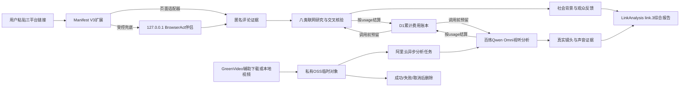

# 镜谱 Shotprint

镜谱把一条 AI 影视/短剧拆成可验证的镜头时间线、叙事曲线、生产参数假设和可迁移模板。默认复刻结构，不复制人物身份、原台词或作品标识。

## 本地启动

要求 Node.js 22.13+ 与 pnpm 10。换电脑时复制项目目录，但不要复制 `.env.local`：

```bash
pnpm install
cp .env.example .env.local
pnpm dev
```

在 `.env.local` 配置百炼、OSS 和随机 `RATE_LIMIT_SALT`。没有密钥时首页与内置样片仍可完整使用，真实上传会收到明确提示。执行 `pnpm run check` 可串行运行类型、schema、切点、OSS 签名、导出、密钥扫描、生产构建和端到端检查。

## 百炼与 OSS 准备

1. 在阿里云百炼华北 2（北京）创建 API Key，推荐模型 `qwen3.5-omni-plus`。如使用业务空间专属地址，把 `DASHSCOPE_BASE_URL` 改为该空间的 `compatible-mode/v1` 地址。
2. 创建北京地域的私有 OSS Bucket。为 Shotprint 建立最小权限 RAM 凭证，只允许在 `shotprint-temp/` 前缀执行 PutObject、GetObject、DeleteObject。
3. 在 Bucket 的 CORS 中允许站点来源和本地来源，方法只开 `PUT`，允许请求头 `Content-Type`。不要把 Bucket 改成公共读。
4. 把 API Key、RAM AccessKey、Bucket 和 Endpoint 写入 `.env.local`；生产值只写入托管环境 Secret。

百炼支持通过 `video_url` 读取视频；OSS 只生成 15 分钟直传 URL 和 20 分钟读取 URL。浏览器不会收到 OSS Secret。当前产品边界为最长 300 秒、最大 300MB；接近 300 秒的浏览器元数据允许 500ms 封装误差并归一为 300 秒，超过后明确拒绝。

联网研究默认使用 `SEARCH_PROVIDER=bailian-native`、现有 `DASHSCOPE_API_KEY` 和 `DASHSCOPE_SEARCH_MODEL=qwen-plus`，从百炼原生 `output.search_info.search_results` 读取来源；`SEARCH_API_URL/SEARCH_API_KEY` 仅保留给可替换提供者，不是默认配置。搜索鉴权与视频模型权限必须分别实测，变量存在不等于来源可用。

## 20 元硬预算

Shotprint 在 Sites 路径用 D1、在阿里云后端用私有 OSS 状态对象维护累计人民币账本，默认总上限为 `COST_LIMIT_CNY=20`。每次真实分析开始前会原子预留最坏成本；可用余额不足以完成预留时，上传会在调用百炼前被拒绝，内置样片仍可免费使用。响应返回后按百炼 `usage` 中的输入/输出 token 结算并释放差额；响应缺少 usage 时，为避免账单失控会保守计入完整预留额。每份深度舆情研究最多预留4.9元。

默认定价参数对应北京地域 `qwen3.5-omni-plus`：输入 7 元/百万 token、输出 40 元/百万 token，每次分析最多三次模型调用（视听证据提取 + 结构整理 + 最多一次结构修复），单次输出上限 12,000 token，并为 OSS 流量预留固定 0.2 元。因此单次分析预留 5.768768 元，但正常成功后只结算实际 token 费用加 0.2 元。更换模型、地域或价格后，必须同步修改 `COST_*` 环境变量。

账本是累计上限，不会每日或每月自动清零；从首次部署该功能时从 0 元开始统计，不追溯此前账单。只有管理员明确决定开启新预算周期时，才应清理 D1 的 `cost_budget` 与 `cost_reservations` 对应记录。账本不保存 IP、视频或模型内容，只保存微元金额、状态和随机预留 ID。

## 数据流与隐私



- 视频不写入本站数据库、浏览器存储、日志或分析事件，只在私有 OSS 临时存在。
- 百炼与 OSS Secret 仅存在于服务端环境；浏览器只拿到短时签名 URL 和防篡改上传凭证。
- 状态存储（Sites 路径使用 D1，阿里云后端使用私有 OSS 对象）只保存每日加盐 IP 哈希/计数、匿名累计费用账本、60分钟临时研究会话，以及最长30分钟可读取的异步分析任务回执。临时会话仅含来源元数据、已生成社会结论和回执，不含原评论、网页正文、视频或模型原始证据；最终报告成功后删除研究会话，过期任务在下一次查询时清理。
- Shotprint 的硬预算在请求前拦截；阿里云控制台的预算与余额提醒仍建议开启，作为账单侧的第二道提醒。
- 生产参数是带证据和置信度的推测，不是源工程、seed 或 checkpoint 恢复。

## 3 分钟快速体验

1. **0:00–0:30** 打开扩展自检，说明0.6.9主采集通道、平台权限和百炼搜索状态；本地伴侣不是必需项，只在页面适配器失败时启用。
2. **0:30–1:10** 粘贴公开视频链接，展示100条目标、实际样本数、页/游标数、采集引擎和停止原因；需要时续采至200条。
3. **1:10–1:50** 启动八类深研，展示来源数、域名数、检索时间、社会背景、观众共识/争议及每条结论的评论或网页引用。
4. **1:50–2:30** 点击“下载原片并分析”，镜谱复制链接并打开GreenVideo；下载公开MP4后返回选择文件，后续分析自动运行。标签页录制仅作兜底。
5. **2:30–3:00** 展示真实时间码对应的内容机制假设、导演/制作拆解和复刻作战书；作战书包含逐镜任务、失败替代、视觉规则、提示词骨架、剪辑声音、预算工期和上线验证，再导出 Markdown、评论/逐镜 CSV 和 AI 生成包。

## 部署

前端继续部署到 `.openai/hosting.json` 绑定的原 Sites 项目；`SHOTPRINT_API_BASE` 指向北京地域的阿里云 Web 函数。浏览器先读取 Sites 同源配置，再健康检查阿里云地址；阿里云可用时，深度研究、上传会话、视听分析和最终合并均绕开 `chatgpt.site` 的边缘 WAF。阿里云不可用时只降级到同源接口并明确显示状态，不伪造联网结果。

阿里云函数使用 Node.js 22、自定义运行时端口9000、启动命令 `node server.mjs`。环境变量与 `.env.example` 同名；`DASHSCOPE_API_KEY`、`OSS_ACCESS_KEY_ID`、`OSS_ACCESS_KEY_SECRET` 和 `RATE_LIMIT_SALT` 必须只在云端控制台填写。公网触发器允许匿名调用，但应用层只接受生产站和localhost白名单 Origin，并继续执行IP/全局限流、OSS状态锁和20元累计预算硬闸。默认 `fcapp.run` 地址仅适合接口联调；长期生产应绑定备案自有域名或API网关。

当前工作区的 Sites 互联网公开权限由管理员控制。部署后应验证阿里云 `/health`、非法 Origin 403、首页后端自检、样片、限流提示和一次真实分析。

## 运行形态与接口

| 组件 | 位置 | 职责 |
|---|---|---|
| Sites/vinext主站 | `app/` | 输入、状态机、报告、导出与服务端API |
| 阿里云Web函数 | `worker/aliyun-backend/` | 深度研究、OSS上传、视听分析、最终合并、预算与研究会话状态 |
| MV3取证桥 | `extension/` | 用户点击后打开平台页、运行页面适配器并代理本地伴侣 |
| BrowserAct伴侣 | `worker/browser-act-companion/` | 本机网络响应/DOM兜底、播放器从0秒校准；只监听127.0.0.1 |
| 平台技能 | `worker/browser-act-skills/` | 三个平台相互隔离的有界评论与播放策略 |

服务端路由：

- `POST /api/upload-session`：校验分析授权、格式、300秒/300MB边界和预算，再签发短时私有OSS直传会话。
- `POST /api/analyze`：Sites 同源路径可直接执行；阿里云生产路径立即返回 `202 + analysisJobId`，后台核验 OSS 对象后执行 Qwen Omni 取证、qwen-plus 结构整理与最多一次纠正。
- `GET /api/analyze/jobs/:id`：轮询最长30分钟的分析任务；前端最多等待15分钟，任务仍由后端负责结算与清理。
- `GET /api/link-analyze`：只返回搜索提供者是否配置，不暴露密钥或预算余额。
- `POST /api/link-research`：阿里云生产路径返回 `202 + researchJobId`，后台执行八类深度研究。
- `GET /api/link-research/jobs/:id`：轮询研究结果；完成后返回60分钟随机研究会话ID。
- `POST /api/link-analyze`：合并匿名评论、临时研究会话和真实视频证据，生成 `LinkAnalysis link.3`；最终报告成功后删除研究会话。

伴侣接口固定为 `GET /v1/health` 以及 `POST /v1/pair`、`/v1/comments`、`/v1/playback/prepare`、`/v1/cancel`。扩展之外的网页来源会被拒绝；接口不接受任意脚本、命令、文件路径或目标地址。

## 爆款链接取证演示

首页现在支持“粘贴爆款链接”和“上传本地视频”两种入口。链接入口会识别抖音、B站或小红书，并通过 `extension/` 下的 Manifest V3 浏览器扩展打开原页面；只有用户主动点击开始采集后，扩展才读取页面评论，最多 200 条，不无限滚动，不读取 Cookie，不绕过验证码。网页会先确认扩展已连接；B站会在限定范围内定位 Shadow DOM 与旧版评论容器，等待最多 20 秒并持续回传阶段进度。扩展桥通过心跳维持本次任务，网页等待上限与扩展的 90 秒采集上限一致；通信中断或取得 0 条评论时不生成报告，而是显示结构化错误并提供手动导入。

在浏览器扩展管理页打开开发者模式，选择“加载已解压的扩展”，目录指向 `extension/`；当前兼容版本为 0.6.9。首次默认采集100条，用户可在10分钟内复用原标签页和滚动位置续采至200条；每段最多90秒、15次有界滚动。扩展同时采集公开的作品标题、作者、描述、作品ID和规范链接作为联网研究指纹；匿名评论正文仅在当次研究请求内参与分析，不写入研究会话。抖音采集按真实页面验证过的路由滚动层执行“末条定位＋滚轮事件＋平滑滚动”，只把可见验证码判为风控。扩展若在网页打开期间被重新加载，桥接会立即返回`EXTENSION_CONTEXT_INVALIDATED`并要求只刷新镜谱网页；自动重试严格等待旧任务取消确认后再启动新任务。BrowserAct只是可选高级兜底，未运行时不会覆盖扩展主通道错误。验证码、真实的403错误页或429限流页出现时会立即停止并提供手动评论降级。

### BrowserAct 本地伴侣（可选兜底）

伴侣只监听 `127.0.0.1:43129`，公开 Sites 网页不能直接访问，所有请求由扩展后台代理。安装BrowserAct CLI并创建经本人确认的本机 `chrome-direct` 后运行：

```powershell
.\worker\browser-act-companion\start.ps1
```

脚本在只有一个本地直连时会自动选择；否则显式传入 `-BrowserId`，或预先设置 `SHOTPRINT_BROWSER_ID`。启动窗口会显示一次性6位配对码；在镜谱自检区输入后，扩展只在内存保存30分钟会话令牌。不复制Cookie，不提交BrowserAct运行目录、Chrome配置或登录态。

采集顺序为扩展DOM→BrowserAct页面网络响应→BrowserAct DOM→手动导入。B站网络策略已用页面自行生成的WBI签名请求验证100条初采和199条脱敏续采；抖音已用真实页面验证100条伴侣回执和10个网络分页。小红书已验证页面滚动可读100条，但独立重放其签名评论URL会返回406，因此伴侣只读取浏览器已经收到的响应；新开的全页形态可能只返回部分样本，必须显示实际数量并允许续采或手动导入。三平台均不逆向签名。BrowserAct运行目录、浏览器配置、HAR、请求头和登录态不进入仓库。换电脑时需重新安装BrowserAct、创建本机直连并重新登录平台。

评论停靠后，`/api/link-research` 固定执行原视频/转载、作者背景、传播时间线、社会议题、支持与批评、AI制作、平台传播、媒体行业八类检索；规范链接、作品ID、清洗后的标题、作者和描述共同构成检索指纹，标题缺失时仍保留规范链接与路径作品ID，不使用“标题未知”污染查询。最多4路并发，合并8–20个HTTPS来源、至少3个域名，同域最多3条。研究摘要和来源交给一次结构化综合，每条非unknown结论必须引用匿名评论ID或来源ID。服务端返回60分钟随机研究会话ID，后续补视频时不会重复付费搜索，也无需再次上传大型研究包。

取得社会层报告后，推荐点击“下载原片并分析”：镜谱只复制当前视频链接并在新标签页打开GreenVideo，用户自行下载有权分析的公开MP4/MOV，返回选择文件后自动执行本机切点、OSS临时上传、Omni原始视听取证、qwen-plus结构整理和最终报告合并。300秒视频的本机抽帧最多约300个采样点，生产分析转为可轮询的异步任务，避免API网关长连接超时。结果必须同时通过首尾时间轴、每分钟证据密度、开中尾叙事、至少45%本机切点召回和可执行复刻字段校验；第一次不通过会基于同一原始证据纠正一次，仍不通过则停止并清理，不输出假完整报告。镜谱不会调用GreenVideo内部接口，也不会向其发送评论、研究结果、Cookie或身份信息。无法下载时才录制原视频标签页；WebM仅作为录制兜底。未捕获音轨时明确标为 `VIDEO_AUDIO_MISSING`，只做纯画面分析。项目不解析平台媒体地址、不逆向签名。没有视频证据时，社会原因与观众反馈可展示，但导演、制作、时间码和复刻方案保持锁定。

评论主题与情绪按实际样本频次排序；本地合并时只保留能重新匹配的评论证据编号，不再给无关结论补任意评论。视频与评论的交叉结论表述为“可验证假设”，必须同时给时间码、反证和上线指标，不能把同步出现写成传播因果。完整的数据契约、验证门槛和运维检查见 [`docs/video-analysis.md`](docs/video-analysis.md)。

## 跨电脑迁移

迁移时只复制包含 `package.json`、`pnpm-lock.yaml`、`app/`、`lib/`、`worker/`、`tests/` 和 `.openai/hosting.json` 的项目源码；在新电脑执行 `pnpm install --frozen-lockfile`，从 `.env.example` 重新创建 `.env.local`，再按上文重新加载 `extension/`。不要复制 `node_modules/`、`dist/`、`outputs/`、`worker/aliyun-backend/build/`、BrowserAct运行目录、缓存或 `.env.local`。同一 Sites 与阿里云资源可继续复用；更换阿里云账号、地域或OSS Bucket时需重新部署 Web 函数并填写云端密钥。
