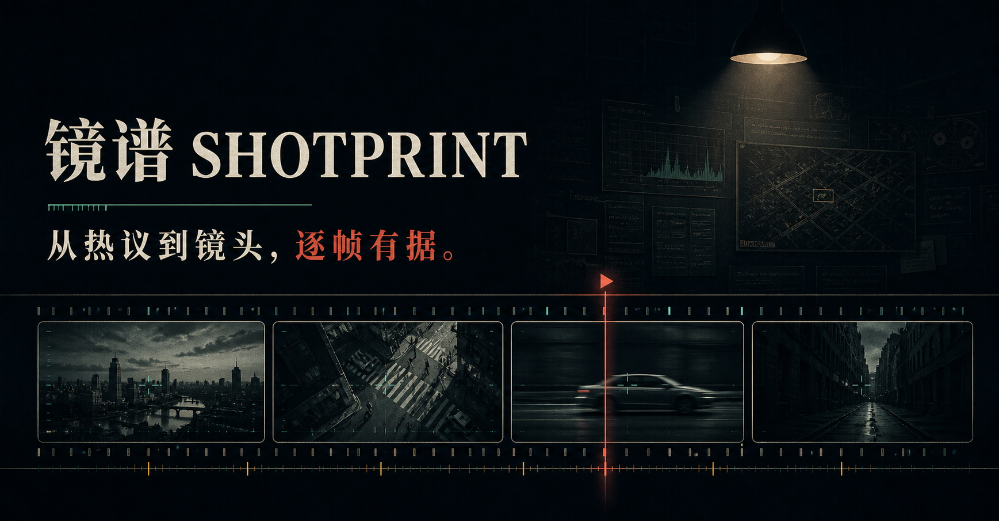
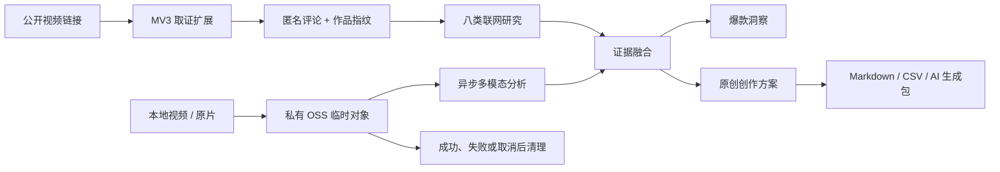

# 镜谱 Shotprint

> 别让爆款，只躺在收藏夹。

[](https://shotprint.xyz)
[](https://shotprint.xyz)
[](#核心产品判断)



镜谱是一款面向短视频创作者与内容团队的视频拆解产品。它把公开视频、匿名评论、公开资料与真实视频依据放在一起，帮助创作者看清观众在意什么、镜头怎样推进，并整理成可以修改和执行的原创创作方案。

**在线体验：[shotprint.xyz](https://shotprint.xyz)**。生产更新沿用原 Cloudflare 项目，不迁移到 Sites。

## 为什么做镜谱

常见的爆款分析往往停在“节奏好、情绪强、画面高级”这类正确但难以行动的描述上，同时存在三个问题：

- **研究成本高**：评论、传播背景、争议观点与视频内容分散在不同位置，需要反复切换和手工整理。
- **结论难验证**：模型容易把评论推测、网页观点和镜头事实混在一起，给出没有来源的确定性结论。
- **洞察难落地**：知道“为什么有效”，不等于知道下一条内容具体怎么拍、怎么剪、怎么验证。

镜谱将问题重新定义为一条证据链：先确认“发生了什么”，再解释“为什么有效”，最后回答“下一步怎么做”。

## 核心体验

### 1. 从公开视频还原传播语境

粘贴抖音、B 站或小红书链接后，浏览器扩展在用户主动触发时采集最多 200 条去标识化评论，并保留作品标题、作者、作品 ID 与规范链接。系统围绕原视频与转载、作者背景、传播时间线、社会议题、支持与批评、AI 制作、平台传播、媒体行业八类主题进行联网研究。

0.7.1 流程支持整段分享文本、多链接选择、作品身份绑定和可访问 MP4 读取；不能获取完整音视频时保留评论，提供用户确认的标签页录制或原片上传入口，不再要求外部下载网站。平台登录或验证仍由用户在原页面完成；验证边界见运维文档。

### 2. 从真实视频建立视听证据

支持 MP4、MOV、WebM，最长 300 秒、最大 300MB。视频经私有 OSS 临时上传后，由多模态模型提取画面、声音、叙事与制作迹象；长任务使用异步执行与轮询，避免同步请求超时。

### 3. 从多源证据生成可验证洞察

每条关键结论必须关联匿名评论编号、公开来源或真实视频时间码，并展示置信度、反证与未知项。没有取得视频证据时，导演、制作、时间码和创作方案保持锁定，不用推测补齐事实。

### 4. 从分析转成创作方案

最终报告不仅解释一条视频哪里有效，还提供逐镜任务、摄影与光线、声音设计、拍不了时的替代做法、画面规则、提示词、剪辑节拍、工期方案和上线验证指标。创作方案只借鉴结构、节拍与制作方法，人物身份、台词、作品标识和可识别 IP 必须原创。

报告可导出为 Markdown、评论 CSV、逐镜 CSV 与 AI 生成包。

## 核心产品判断

| 产品问题 | 镜谱的选择 | 原因 |
|---|---|---|
| 如何降低 AI 幻觉？ | 证据优先，结论绑定来源、评论或时间码 | 让用户能够回看和质疑，而不是只能相信模型 |
| 本地视频能否分析传播历史？ | 不能；传播研究必须从公开视频链接进入 | 本地文件无法可靠恢复平台身份、发布时间与传播轨迹 |
| 长视频如何避免只分析开头？ | 均匀保留首、中、尾与逐分钟证据 | 禁止用只截取前段的方式压缩上下文 |
| 模型输出不完整怎么办？ | 先确定性闭合时间轴、重算统计并从已验证镜头生成执行方案；只有真实证据问题才交回模型纠正 | 格式偏差不再报废整份分析，同时不放松证据门槛 |
| 如何让创作方案真正可执行？ | 强制输出镜头任务、失败替代、时间计划与验证指标 | 把泛化建议变成可拍摄、可检查、可迭代的动作 |
| 如何控制真实调用风险？ | 调用前预留、按实际用量结算、异常保守处理 | 把成本治理做进产品链路，而不是事后查看账单 |

## 证据链与系统架构



| 层级 | 主要职责 |
|---|---|
| Cloudflare / React 主站 | 双入口、任务状态、报告阅读与导出 |
| 阿里云函数 | 联网研究、上传会话、异步视听分析、证据融合 |
| 百炼 Qwen | 原始视听取证与结构化整理 |
| 私有 OSS | 短时视频直传、任务回执与临时状态 |
| Manifest V3 扩展 | 三平台作品指纹与去标识化评论采集 |
| BrowserAct 本地伴侣 | 页面适配器失败时的可选、受控兜底 |

## 质量与安全边界

- 300 秒结果需覆盖首尾、逐分钟证据、开中尾叙事与本机候选切点，并通过可执行性校验。
- 时间轴闭合、统计值、叙事点分布和创作方案格式由程序依据既有镜头证据确定；真实证据仍不合格时只允许基于同一证据纠正一次，失败则返回可见的安全诊断码。
- 视频只进入 `shotprint-temp/` 私有 OSS，不写入站点数据库、浏览器存储或分析事件；成功、失败和取消都承担清理责任。
- OSS 与模型密钥只存在于服务端；浏览器只获得短时签名 URL 和防篡改上传凭证。
- 评论采集不读取 Cookie、头像、用户名或用户 ID；遇到验证码、登录墙、403 或 429 会停止，不绕过平台风控。
- 日常验证覆盖类型检查、单元测试、密钥扫描、生产构建、端到端测试与代码规范检查。

完整的视频分析契约、验证门槛和运维说明见 [docs/video-analysis.md](./docs/video-analysis.md)。浏览器扩展安装方式见 [extension/INSTALL.md](./extension/INSTALL.md)。

## 技术栈

`React 19` · `Next.js 16` · `TypeScript 5.9` · `vinext` · `Cloudflare / D1` · `阿里云函数计算` · `OSS` · `百炼 Qwen Omni` · `Manifest V3` · `Zod` · `Drizzle ORM`

## 本地运行

需要 Node.js 22.13+ 与 pnpm 10：

```bash
pnpm install --frozen-lockfile
cp .env.example .env.local
pnpm dev
```

没有云端密钥时，首页与内置样片仍可使用；真实上传和联网研究会给出明确的配置提示。生产 Secret 只应填写在托管环境中，不要提交 `.env.local`。

运行完整的本地质量检查：

```bash
pnpm run check
pnpm run lint
```

真实服务验证会访问 OSS 与模型服务，仅在明确授权的受控环境中运行：

```bash
pnpm run test:real
```

验证指定文件时可设置 `REAL_VIDEO_PATH` 和对应的 `REAL_VIDEO_DURATION_MS`；脚本会额外检查完整时间轴、证据覆盖、创作方案可执行性、费用结算和临时文件清理。

## 项目结构

```text
app/                         产品界面与服务端路由
lib/                         分析、证据、研究、状态与费用治理
extension/                   三平台 Manifest V3 取证扩展
worker/aliyun-backend/       生产异步分析后端
worker/browser-act-companion/本地受控兜底伴侣
tests/                       单元、对抗、端到端与安全检查
docs/video-analysis.md       视频分析契约与运维说明
```

---

镜谱关注的不是生成更多结论，而是让每个结论都能回到证据，让每条建议都能进入下一次创作。
