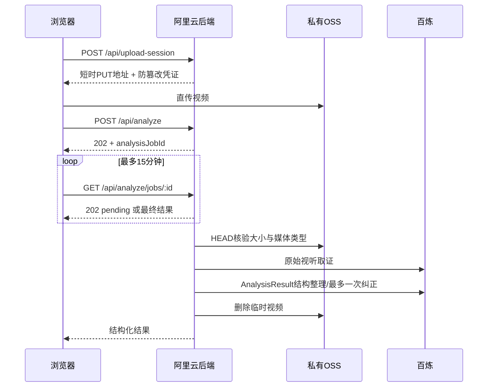

# 300 秒视频分析契约与运维

本文是 Shotprint 视频上传、视听取证、报告合并和“复刻作战书”的权威说明。代码入口为 `app/ShotprintStudio.tsx`、`app/api/analyze/route.ts`、`lib/analysis.ts`、`lib/link-analysis.ts` 与 `worker/aliyun-backend/server.ts`。

## 能力边界

- 接受 MP4、MOV、WebM，最长 300 秒、最大 300MB。封装读取产生的 500ms 以内尾差会归一为 300 秒。
- `qwen3.5-omni-plus` 用于原始视听取证，`qwen-plus` 只依据原始证据做结构整理。长视频不是靠固定模板补齐。
- 本地视频入口能分析画面、声音、叙事和制作迹象，但不能仅凭文件可靠恢复它来自哪个平台链接、发布时间或传播历史。需要传播时间线、共鸣和争议时，必须先走“分析公开视频”入口，让规范链接、作品ID、标题、作者、描述、评论和网页来源共同参与研究。
- “为什么爆”只能输出证据支持的事实或待验证推断。账号体量、投流、推荐机制和留存数据不可见时必须进入反证或未知项。

## 生产链路



阿里云生产路径必须异步执行，因为 300 秒视频的模型处理时间可能超过 API 网关同步请求上限。任务回执可读取 30 分钟；前端等待 15 分钟后会停止轮询，但后台仍负责完成费用结算和临时视频清理。Sites 同源接口保留直接响应，用于无外部后端的部署形态。

## 结果硬门槛

`AnalysisResult v1` 通过 schema 后还必须满足：

1. 模型时长与浏览器时长误差不超过 500ms，首镜从 500ms 内开始，末镜覆盖到结尾前 500ms。
2. 镜头时间必须递增、无大于 500ms 的空洞，且每个镜头有非 `unknown` 的观察证据。
3. 15 秒以上至少 3 个证据镜头；120–300 秒至少每分钟一个证据段并额外覆盖结尾。
4. 叙事强度点必须覆盖开头 15%、中段 35–65% 和结尾 15%。
5. 本机检测到至少 4 个内部切点时，模型镜头边界在 ±1500ms 内的召回率不得低于 45%。本机切点是复核线索，不覆盖模型的视听判断。
6. 复用模板必须包含至少 3 个故事变量、可计时节拍、可检查视觉规则、至少 3 条具备镜头要素的提示词、原创限制和可计时的剪辑声音计划。

第一次结构或语义校验失败时，服务端把错误码连同同一份原始证据交给结构模型纠正一次；第二次仍失败就返回明确错误并清理临时视频。不得放宽校验换取“看起来成功”。

## 报告与复刻作战书

模型原始证据与结构结果各自最多保留48个连续时间段；实际镜头更多时合并相邻段并优先保留每分钟和本机候选切点附近差异，仍须无空洞覆盖全片。前端合并最多 72 个均匀分布的证据镜头，始终保留首镜、末镜和中段，避免长片只传前 60 镜。最终作战书最多展示 24 个覆盖全片的关键执行镜头，并包含：

- 原创迁移方向、目标观众、情绪目标和总时长；
- 每镜任务、摄影/光线/声音、难度及低成本失败替代；
- 视觉圣经、镜头提示词骨架、剪辑与声音落点；
- 个人验证版和 2–3 人完整成片的工期/预算范围；
- 钩子 A/B、转折声音实验，以及 3 秒留存、节点留存、完播、转发、收藏和评论主题指标；
- 人物身份、台词、作品标识和可识别 IP 的原创边界。

评论主题和情绪按样本频次排序。视频时间码只附加到明确写成“待验证假设”的内容机制结论，并同时展示反证；系统不再把第 N 条社会结论机械绑定到第 N 个镜头。

## 环境与发布

生产至少配置：

| 变量 | 要求 |
|---|---|
| `DASHSCOPE_MODEL` | `qwen3.5-omni-plus` 或已验证的同等长视频模型 |
| `MAX_VIDEO_DURATION` | `300` |
| `MAX_VIDEO_BYTES` | `314572800` |
| `SHOTPRINT_API_BASE` | 阿里云后端 HTTPS 地址 |
| `OSS_*`、`DASHSCOPE_API_KEY`、`RATE_LIMIT_SALT` | 只存在于云端 Secret |
| `COST_LIMIT_CNY` | 默认 20；调整前同步预算说明和告警 |
| `COST_MAX_OUTPUT_TOKENS` | `16000`；给300秒结构结果保留完整JSON空间 |

发布阿里云后端后依次验证：

1. `GET /health` 返回 `200`，非法 Origin 返回 `403`。
2. `POST /api/analyze` 在阿里云路径快速返回 `202`，随后任务查询返回 `202` 或最终 JSON，不保持长连接。
3. 300 秒/300MB 边界可进入上传会话，超过任一边界返回 `413`。
4. 模型失败、结构失败、取消和成功路径都能删除 `shotprint-temp/` 对象；费用预留最终结算或保留为可见告警。
5. 使用链接入口时，最终报告保留原规范链接，尾部镜头仍出现在作战书中。

## 验证命令

```bash
pnpm run typecheck
pnpm test
pnpm run scan:secrets
pnpm build
pnpm run test:e2e
pnpm run lint
```

`tests/video-adversarial.test.ts` 覆盖 300 秒完整结果、稀疏伪结果、本机切点低召回、空泛复刻文案、长时间轴抽样、检索身份和异步任务路由。`pnpm run test:real` 会调用真实 OSS 与百炼并产生费用，只能在明确授权和受控预算下运行；常规 CI 不执行它。
